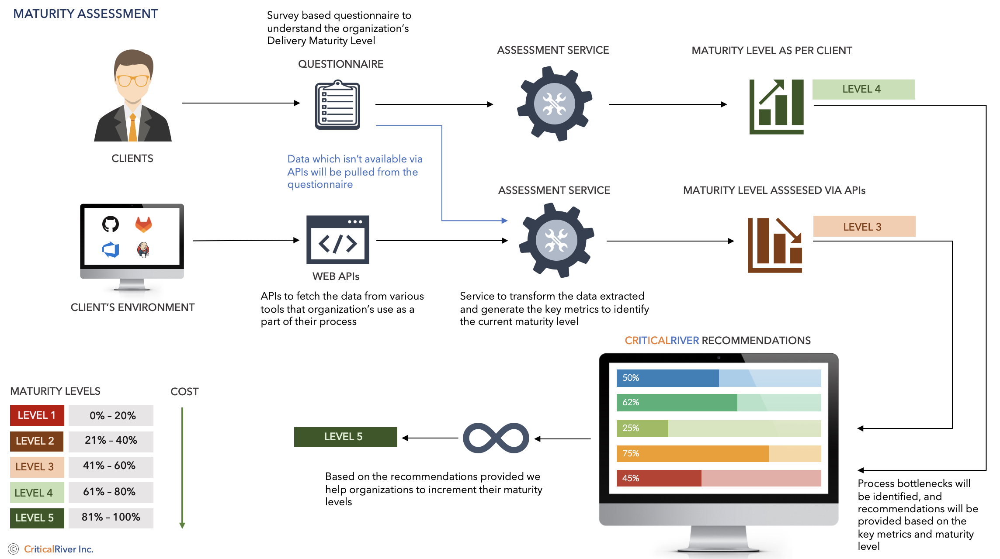
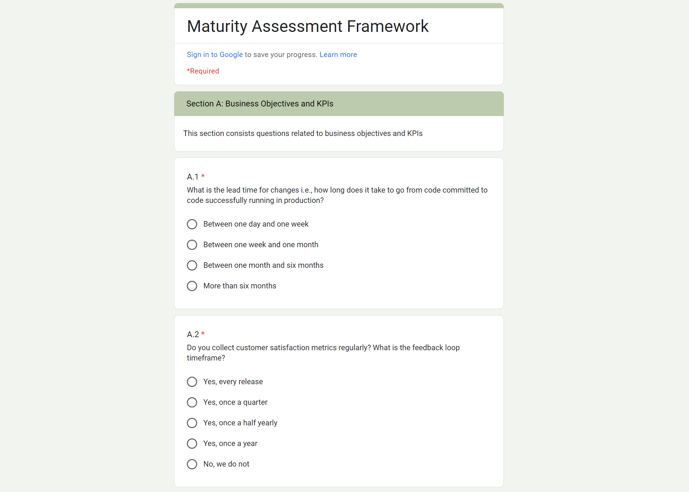
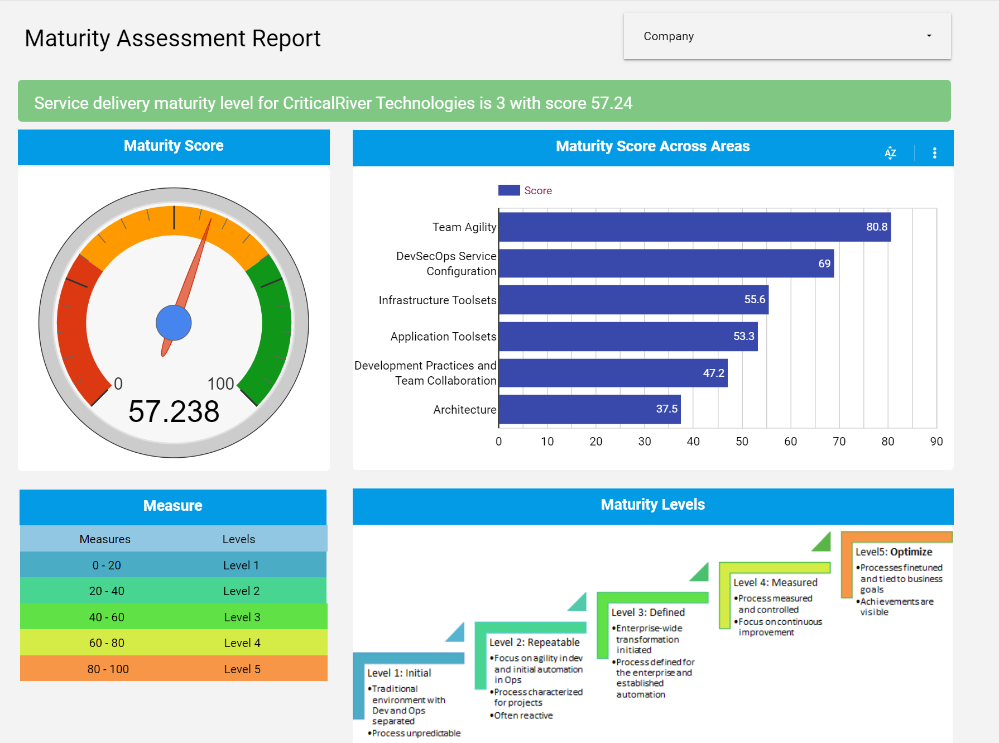

# Maturity Assessment for Service Delivery

Please be aware of this before completing our survey: The email you use to log in must be a Google account, and the email used to access the survey results on Google Data Studio must match.

# Inspiration for the idea

Our tech team has seen many product managers and leaders in organizations struggle to understand various team standards and overall performances in a comprehensive manner through simple dashboards. Many used some internal solutions such as excel sheets to evaluate these performance sheets or providing approximate numbers by analysing various systems manually. However, the methods lack proper validation systems to support the submitted metrics. Accurate performance metrics in various areas helps the teams to understand their pain points and resolving these improves the quality in their service delivery.

# Our approach

We imagined a solution for product managers, leaders, and technical directors where they can simply answer few questions around their service delivery, their approach and actions against few standard delivery challenges, and maintenance of various systems. These responses provide a 360-degree overview of their service delivery which determine their maturity level in few areas and overall maturity level score. However, through this survey we can only determine approximate metrics based on the responses.

To determine the accurate performance metrics or to validate the maturity levels derived from responses to the survey, we need a system to read through various systems, extract information which supports service delivery (such as build and release pipelines, repositories for pull requests and change request tracking, incident management systems for quality in delivery and resolution time, code scan results for application security and system reports for infrastructure security results etc.), and provide accurate maturity levels.

Figure 1: High-level design diagram for Maturity Assessment Solution

# What are Maturity Levels for Service Delivery

A maturity level is a well-defined evolutionary plateau toward achieving a mature software process. Each maturity level provides a layer in the foundation for continuous process improvement. Maturity level ratings range from 1 to 5, with level 5 being the highest level and the goal towards which organizations are working. The five CMMI maturity levels are:

1.  Initial
2.  Managed
3.  Defined
4.  Measured
5.  Optimized

Read [this](https://www.bmc.com/blogs/cmmi-capability-maturity-model-integration/) article to know more about maturity levels.

Our goal is to identify the maturity level of these organizations through the simple survey form and automated in-depth analysis through reading the relative data by using APIs and help them improving the maturity level by providing recommendations and actively engaging with their teams when needed.

# How are we building it

For the survey, our initial approach is to provide them in simple form to collect responses and store them simple sheets for further evaluation. This was further evolved into storing the responses to a relational database solution which can be utilized to evaluate performance metrics and can be validated later by automatic evaluation process by reading the systems. Hence, we have selected Google forms to host our questionnaire across different sections. The main reason behind the Google forms is that the responses can be accessed through APIs and can be further processed by using ‘Apps Script’, a native Google solution to automate the steps in various google applications. Through Apps Script, each response is evaluated and stored in an Azure SQL server automatically. The maturity levels are presented in Google Data Studio and via individual communications. This solves half of the problem only. These results must be validated automatically to provide accurate information.

To derive the accurate metrics, we have built connectors and web hooks to few tools and platforms which can easily connect to their systems and extract information through APIs and converts into simple performance metric numbers. These metrics will also be stored along with the results derived from survey and will be presented in Google Data Studio.

# Challenges we ran into

Though the approach and solution look straightforward, we have our share or challenges while building the initial solution. The main challenge with survey approach is framing the appropriate questions to understand the service delivery standards. The vast industry experience of our team members in various industry and domain knowledge helped a lot in building questionnaire for the survey, the appropriate multiple options, and their weightage. These questions target to address the maturity standards in various areas of service delivery systems such as ‘Team Agility’, ‘Architecture’, ‘DevSecOps Practice’, ‘Development Practices and Team Collaboration’ etc. Other challenge worth mentioning is adopting Google Apps script for automating the evaluation which is different from traditional scripting and understanding Google form APIs to achieve the automation.

Another main challenge for automatic evaluation of performance metrics through APIs is creating a seamless integration to their tool stack, extracting the desired information through APIs, and transforming them into desirable format to evaluate the accurate metrics. Our strong technical team was successful in achieving this for few leading tools and implemented the same for our initial solution.

# What we learned

Though our solution brings more value to the teams and organizations through their service delivery and various performance metrics and helps understanding their pain points throughout the systems, the initial version of this solution consists of two individual solutions. Managing both at their end and integrating is quite challenging. The main drawback with 3rd party solutions such as Google forms which limits the capabilities that we can bring to this solution. We were quick with adopting different technologies and able to address the challenges.

# What to expect in upcoming versions

The future versions of maturity assessments solution will explore more areas and evaluate with even more accuracy. We are working towards providing a simple web-based version for survey with easy customizations and even more simpler integrations with wide-range of tools. Dashboards will have deeper insights and capable of exploring each individual area metrics and analysis results. We will provide recommendations for each area based on the evaluated metrics and help the teams to improve their maturity scores and quality in service through this application.

# Built with

ASP .NET, Google forms, Google Apps Script, Azure SQL Server, and Google Data Studio

# Try it out

You can try the assessment through survey method by clicking the following link and submit the response. <https://forms.gle/RA9HdmjG3UpNUT6x5>

# Screen Prints

Figure 2: Maturity Assessment Form

Figure 3: Maturity Assessment Result Dashboard
